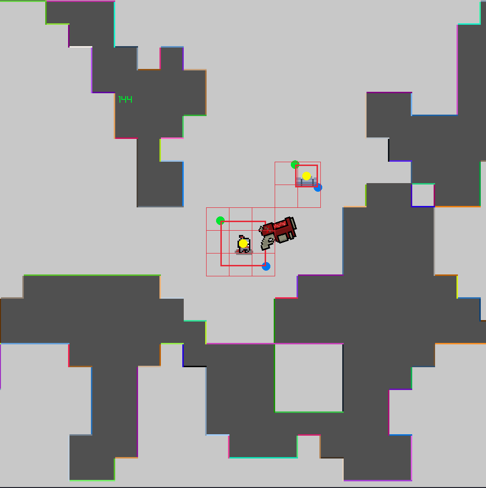

# rlib_game

Pet project game written in **C++** using **raylib**.  
The goal of the project is to explore low-level game architecture, spatial partitioning, and engine-like systems without relying on heavyweight frameworks.
<p align="center">
  
</p>

## Features

- [x] GameObject-based architecture
- [x] Dynamic objects with update lifecycle
- [x] Player movement and input handling
- [x] Procedural / random map generation
- [x] Spatial collision system for dynamic objects
- [ ] Spatial collision system for static objects
- [ ] Enemies
- [ ] Enemy behavior
- [ ] Multithreading

- [ ] Entity-component system (ECS) experiment
- [ ] Save / load system
- [ ] ...

## Architecture Overview

The project is built around a custom **GameObject system**:

- Each entity in the game is a `GameObject`
- Objects are owned via smart pointers
- A central `GameRoot` manages object lifetime
- Dynamic and static objects use separate spatial grids for collision queries

### Collision System

Two independent spatial partitioning systems are used:

- **Dynamic grid** — optimized for frequently moving objects
- **Static grid** — optimized for static level geometry

This reduces collision checks from *O(n²)* to localized queries.

## Technologies

- **Language:** C++
- **Graphics:** raylib
- **Build system:** Make
- **Platform:** Linux (primary)

## Build & Run

### Requirements

- C++17 compatible compiler
- raylib installed
- GNU Make

### Build

```bash
git clone https://github.com/6opbka/rlib_game.git
cd rlib_game
make
